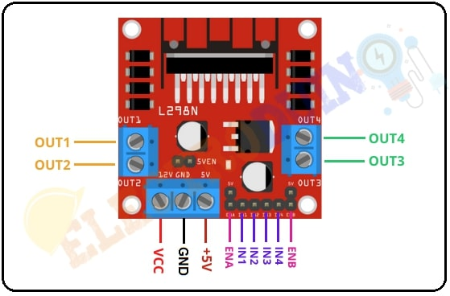

# L298N

### Описание выводов модуля L298N

| Название  | Назначение          | Описание                                                                 |
|-----------|---------------------|--------------------------------------------------------------------------|
| +12V / VS | Питание моторов     | 6–24 В (рекомендуется 12 В). Обеспечивает ток для двигателей.            |
| GND       | Общая земля         | Соединяется с землёй источника питания моторов и логики.                 |
| +5V       | Выход/вход логики   | Если перемычка установлена – выход 5В для микроконтроллера. Если снята – вход 5В от внешнего стабилизатора. |
| ENA       | ШИМ / Enable канал A | Подача логической 1 или ШИМ-сигнала (0–100%) для разрешения и регулировки скорости мотора A. |
| IN1, IN2  | Управление каналом A | Задают направление вращения мотора A (00 – тормоз, 01 – вперёд, 10 – назад, 11 – тормоз). |
| ENB       | ШИМ / Enable канал B | Аналогично ENA, но для мотора B.                                          |
| IN3, IN4  | Управление каналом B | Аналогично IN1/IN2 для мотора B.                                         |
| OUT1, OUT2| Выход на мотор A     | Подключаются к клеммам двигателя A.                                      |

Для корректной работы на вход PWM необходимо подать сигнал периодом в 10 мкс (100 КГц) и коэффициэнтом заполнения 0-100%. При 0% мотор не крутится, при 100 - едет на максимальной скорости.

### Характеристики драйвера L298N

| Характеристика               | Значение                             |
|------------------------------|--------------------------------------|
| Логическое напряжение (VSS)  | 4.5 – 7 В (рекомендуется 5 В)        |
| Напряжение питания моторов (VS) | 6 – 46 В (рекомендуется 12–24 В)   |
| Средний ток на канал         | 2 А (при 25°C)                       |
| Пиковый ток на канал (кратковременно) | 3 А                           |
| Общий максимальный ток       | 4 А (оба канала)                     |
| Падение напряжения (насыщение) | 1.2 – 2.0 В (зависит от тока)     |
| Частота ШИМ (рекомендуемая)  | до 40 кГц (оптимально 20 кГц)        |
| Логические уровни            | TTL (0 = <1.5 В, 1 = >2.3 В)         |
| Ток потребления логики (без нагрузки) | 10 – 100 мА (типично 50 мА)  |
| Защита от обратных ЭДС       | Встроенные диоды Шоттки (в модуле)    |
| Диапазон рабочих температур  | -25 °C … +130 °C (микросхема)        |
| Температура отключения (thermal shutdown) | 165 °C                    |
| Размеры модуля (типовые)     | 43 x 43 x 27 мм (с радиатором)       |
| Вес модуля (с радиатором)    | ~35 г                                |
| Тип корпуса микросхемы       | Multiwatt15 (вертикальный) или PowerSO20 |

## Инициализация модуля на МК

### Функции

- **perform_servo_control_step()** - функция шага поворота. Выполняется в основном цикле проекта. Берёт значение скорости из глобальной переменной *SPEED_DESIRED()*, меняет значение CCR для TIM4 раз 50мс. Направление вращения колёс, зависит от того, положительная или отрицательная переменная *SPEED_DESIRED()*. За направление ответственны пины PA5 И PB15.
- **init_motor()** - функция инициации мотора.
