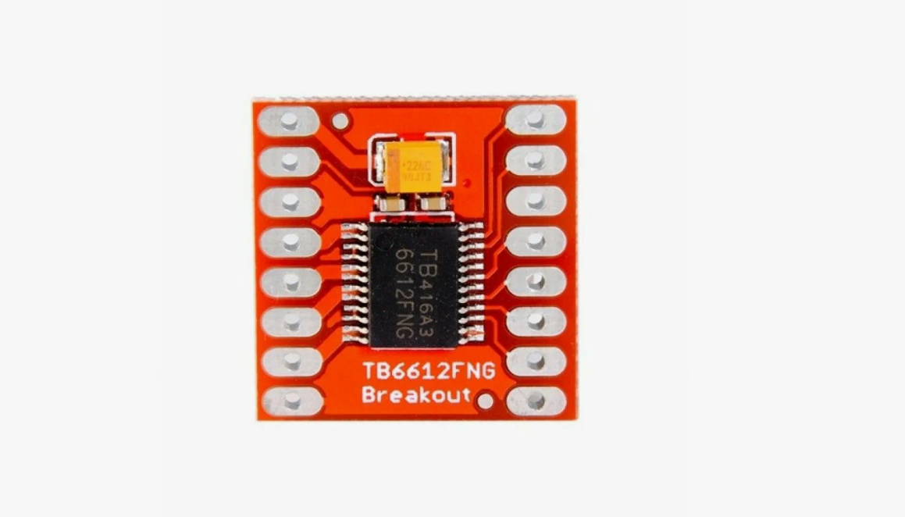
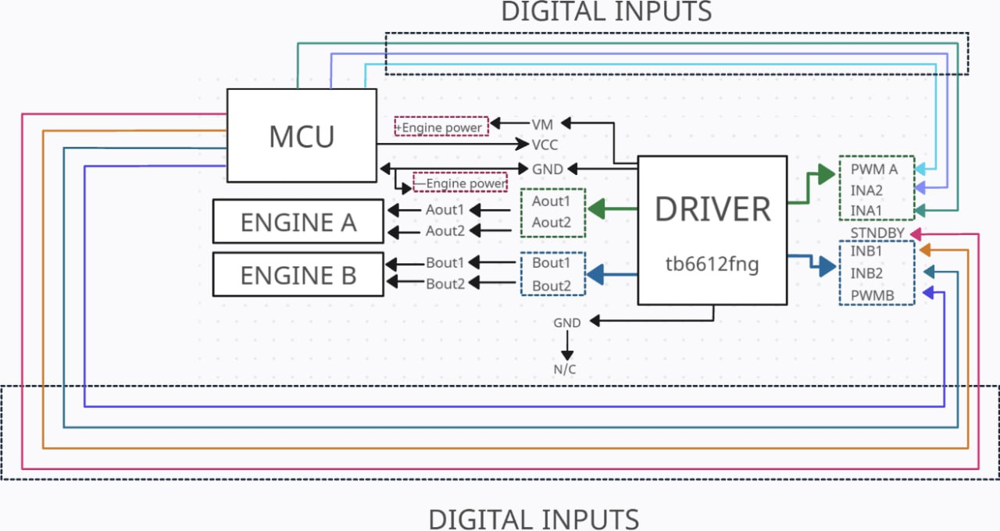

This is README for Main engine technical documentation file
# TB6612FNG

# Алгоритм работы драйвера TB6612FNG

### Описание входов 
| Название | Назначение | Описание                             |
|----------|------------|--------------------------------------|
| PWMA     | ШИМ двигателя A             | ШИМ с коэффициентом заполнения 0-100%|
| PWMB     | ШИМ двигателя B             | ШИМ с коэффициентом заполнения 0-100%|
| VM       | Питание силовой части       | 2.5-13.5В(рекомендуется 5В)          |
| Vcc      | Питание логической части    | 2.7-5.5В(рекомендуется 3В)           |
| AO1,A02  | Выводы двигателя A          | Подключение двигателя A              |
| AIN1,AIN2| Входы управления двигателя A| Управление направления вращения      |
| BO1,B02  | Выводы двигателя B          | Подключение двигателя B              |
| AIN1,AIN2| Входы управления двигателя B| Управление направления вращения      |
| STBY     | режим ожидания              | Управление режимом ожидания          |
| GND      | Земля                       | Земля                                |

Для корректной работы на вход PWM необходимо подать сигнал периодом в 10 мкс (100 КГц) и коэффициэнтом заполнения 0-100%. При 0% мотор не крутится, при 100 - едет на максимальной скорости.

### Характеристики

| Характеристика          | Значение            |
|-------------------------|---------------------|
| Вес                     | 1.3 г               |
| Размеры                 | 20.5 x 20.4 x 6 мм  |
| Диапазон температур     | -20 ºC – 85 ºC      |

## Инициализация модуля на МК

### Функции

- **perform_servo_control_step()** - функция шага поворота. Выполняется в основном цикле проекта. Берёт значение скорости из глобальной переменной *SPEED_DESIRED()*, меняет значение CCR для TIM4 раз 50мс. Направление вращения колёс, зависит от того, положительная или отрицательная переменная *SPEED_DESIRED()*. За направление ответственны пины PA5 И PB15.
- **init_motor()** - функция инициации мотора.
