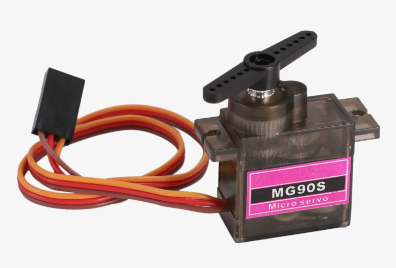
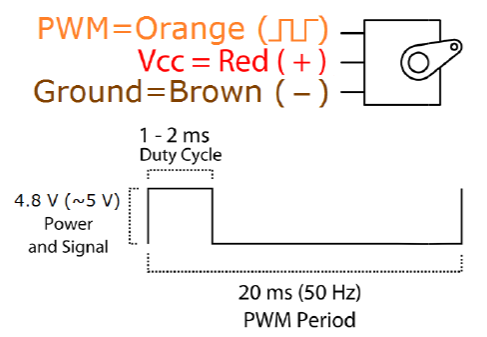

# STM32L1_SG-90

**SG-90** - модель аналогового сервопривода. Состоит из редуктора, работающего от постоянного тока мотора, и управляющей электроники.

## Алгоритм работы сервомотора SG-90

### Описание входов 
| Название | Назначение | Описание                             |
|----------|------------|--------------------------------------|
| PWM      | ШИМ        | ШИМ с коэффициентом заполнения 5-10% |
| Vcc      | Питание    | 4.8-6В(рекомендуется 5В)             |
| GND      | Земля      | Земля                                |

Для корректной работы на вход PWM необходимо подать сигнал периодом в 20 мс (50 Гц) и коэффициэнтом заполнения 5-10%. При 5% мотор устанавливает угол в -90, при 10 - в 90.

### Характеристики

| Характеристика          | Значение            |
|-------------------------|---------------------|
| Вес                     | 9 г                 |
| Размеры                 | 22.2 x 11.8 x 31 мм |
| Крутящий момент         | 1.8 кг/cv           |
| Рабочая скорость        | 60º/1с              |
| Рабочее напряжение      | 4.8 В (~5В)         |
| Максимальное напряжение | 6.6 В               |
| Ширина мертвой полосы   | 10 мкс              |
| Диапазон температур     | 0 ºC – 55 ºC        |

## Инициализация модуля на МК

### Настройка таймеров МК

Мотор подключен к TIM2_CH2 (PA1) микроконтроллера. Для таймера подбираются подходящие значения prescaler и Counter period. Сначала  определяются параметры таймера. Его частота определяется по формуле Frequency = timer clock / (prescaler * counter period). Timer clock определяется по значению частоты на шине APB1, то-есть 32 МГц, counter period для удобства можно взять 20000, нужна чатоста 50 Гц, тогда prescaler =  timer clock / (Frequency * counter period), подставляем значения и получаем 32. Но в CubeMX нужно записать значение PSC - 1, то есть 31.
Также для колибровки используются 2 датчика Холла, подключенные по GPIO (PA11, PA12). 

### Функции

- **perform_servo_control_step()** - функция шага поворота. Выполняется в основном цикле проекта. Берет значение угла поворота из глобальной переменной *ANGLE_DESIRED()*, меняет значение CCR для TIM2 на 10 раз в 5мс в направлении *ANGLE_DESIRED()*.
- **init_servo()** - функция инициации мотора, проводящая колибровку. Выполняется при запуске МК. Колибровка проводится путем нахождения крайних положений колес и принятию "нулевого" угла. Для нахождения крайних положений используются магнитные датчики Холла и магниты. Мотор постепенно меняет свой угол с нуля в одну из сторон. При достижении колесом крайнего положения датчик обнаруживает магнит и передает сингнал, значение текущего угла (MAX_ANGLE) сохраняется и мотор начинает вращаться в другом направлении до тех пор пока не зафиксирует сигнал со второго датчика и сохранит значение второго крайнего угла(MIN_ANGLE). Затем "нулевой" угол устанавливается по следующей формуле: angle = MIN_ANGLE + (MAX_ANGLE - MIN_ANGLE) * calibrate_coefficient, где calibrate_coefficient принимает значения от 0 до 1 и определяется экспериментально при отладке.
